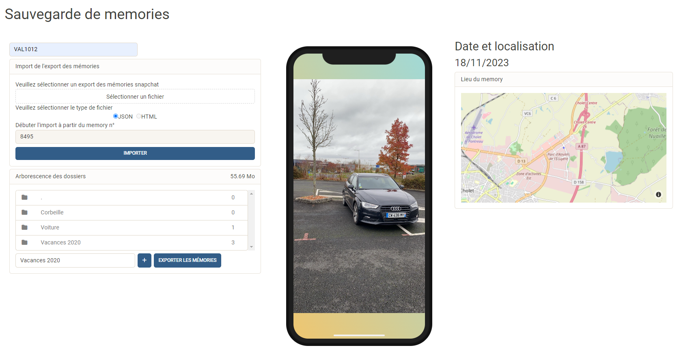

# Snapchat Memories Retriever

## Description
Snapchat Memories Retriever is a web-based application designed to backup, manage, and organize your Snapchat memories. Built using the Dash framework, this tool provides an interactive interface to import Snapchat memories, display and organize them in folders, and export them for safekeeping.

## Features
- **Import Memories:** Upload your Snapchat memories using the export file and view them within the application.
- **Interactive Display:** Browse through your memories displayed in a user-friendly interface.
- **Folder Management:** Organize your memories into custom folders for better management.
- **Map Visualization:** View the geographical location of your memories on a map (if location data is available).
- **Memory Export:** [ONLY FOR HOSTED VERSION] Export your organized memories as a zip file for easy backup.
- **File Handling:** [ONLY FOR HOSTED VERSION] Download and manage memory files with in-built file handling features.

## Installation

### Prerequisites
- Python 3.x
- Dash and other Python libraries (listed in `requirements.txt`)
- A Snapchat account with memories export file

### Steps
1. Clone the repository: `git clone https://github.com/ValentinGuicheteau/snapchat_memories_retriever.git`
2. Navigate to the project directory: `cd snapchat_memories_retriever`
3. Install dependencies: `pip install -r requirements.txt`
4. Set environment variables 
   1. 'TEMPORARY_PATH' : path to the folder were temporary media are stored before deletion/sorting
   2. 'OUTPUT_PATH' : path to the folder where folder are created and media stored
5. [ONLY FOR HOSTED VERSION] Create folder username check next section 'Manage mutliple user'
6. Start the application: `python main.py` (replace `main.py` with the script's filename)
7. The application will be accessible at `localhost:5000` in your web browser

### [ONLY FOR HOSTED VERSION] Manage multiple user

The hosted version supports multiple user sessions, enabling multiple users to save media. To create a username, simply create a folder with the corresponding username. On the web UI, users must enter their username to display the import panel and folder hierarchy.
 
## Usage
1. Open the application in your web browser.
2. Import your Snapchat memories file using the provided interface.
3. Organize, view, and manage your memories within the application.
4. Export your memories as needed for backup purposes.

## Screenshots

## Contributing
Contributions to enhance the application are welcome. For major changes, please open an issue first to discuss what you would like to change.